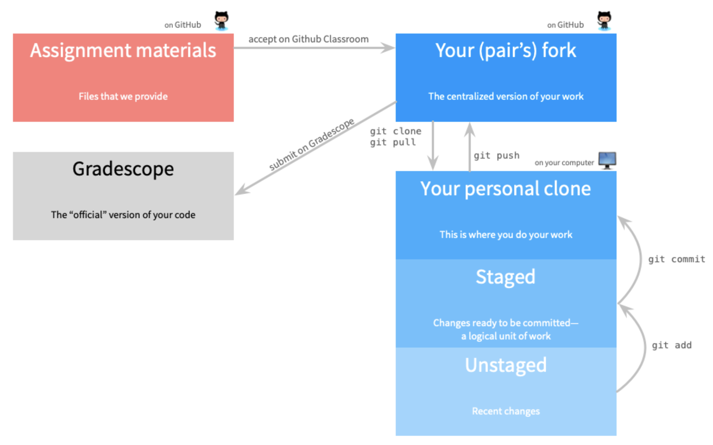
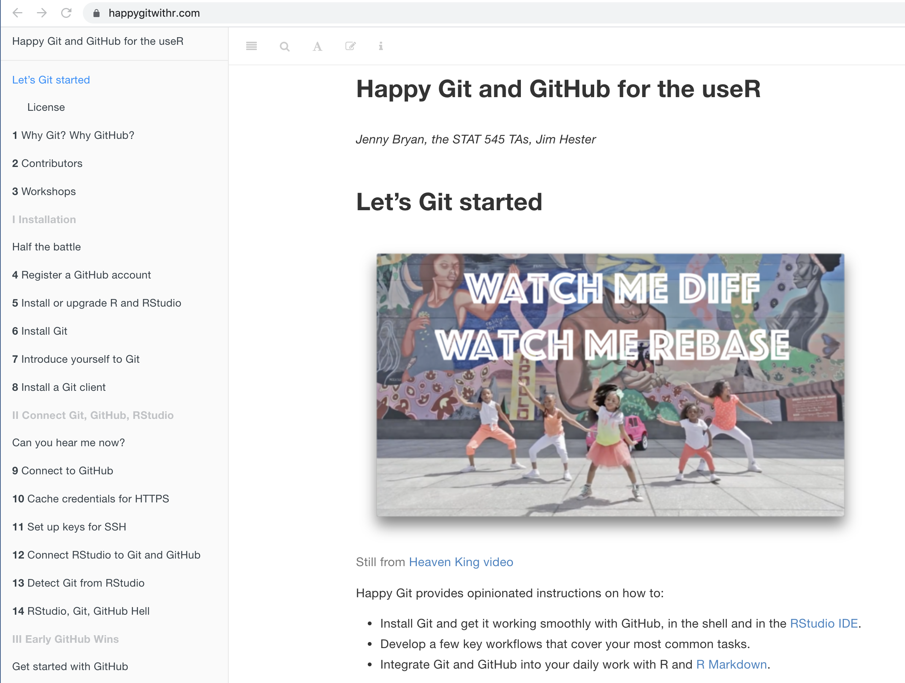
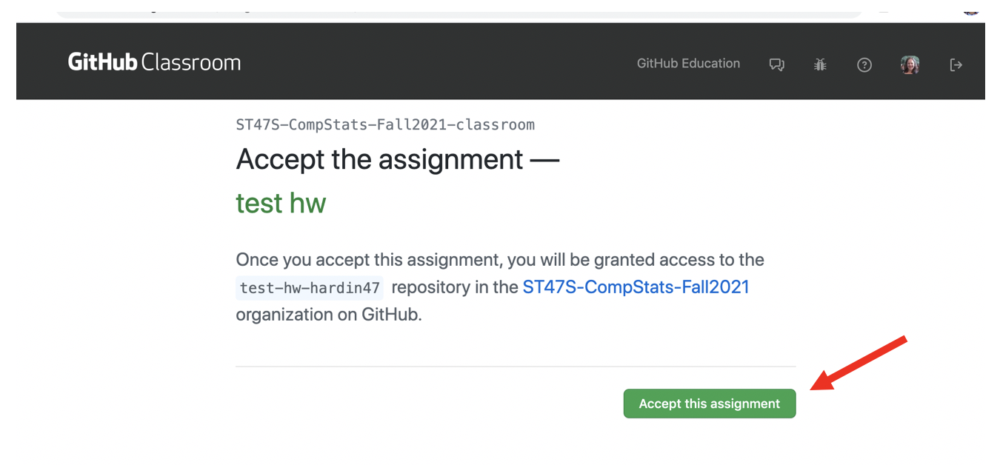
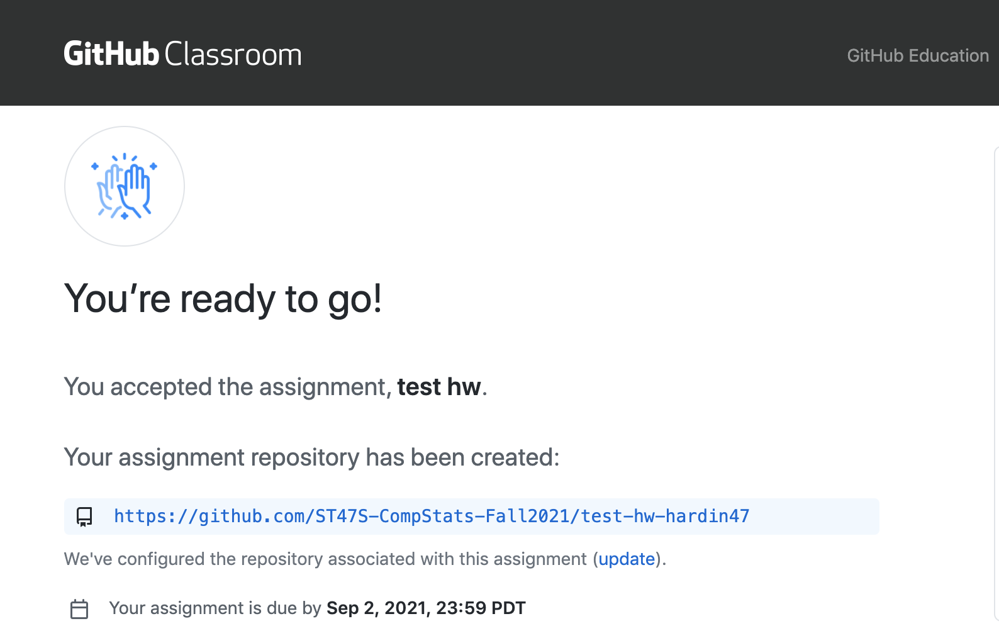
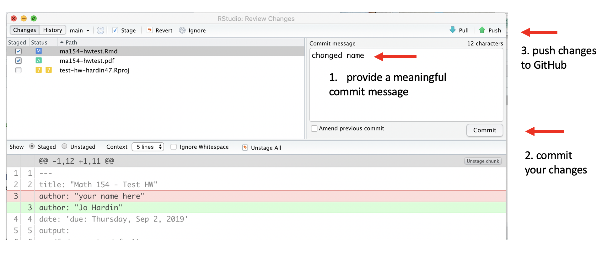
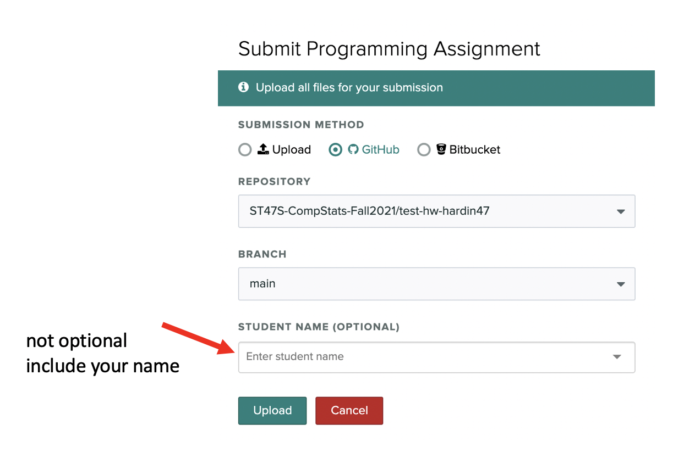

```{r setup, include=FALSE}
knitr::opts_chunk$set(echo = TRUE, message = FALSE, 
                      warning = FALSE, cache = TRUE,
                      fig.width=10, eval.after = 'fig.cap')
library(tidyverse)
library(infer)
library(broom)
library(tidymodels)
library(knitr)
library(viridis)
library(patchwork)

library(praise)
set.seed(4747)
```

# Working on assignments with GitHub and Gradescope


In Math 154, we will use GitHub + Gradescope to access and submit assignments.  Here is the basic structure of how it will work:

1. Get the assignment materials from GitHub classroom.
2. Clone the repository to any machine you are using.
3. Work on the assignment and push back to GitHub.
4. Submit the assignment on Gradescope.

<aside>
```{r echo = FALSE, fig.cap="image credit: xkcd", fig.alt = "xkcd comic detailing that Git can be pretty complicated."}
include_graphics("images/git_2x.png")
```
</aside>

The following diagram lays out the process, and the rest of the document provides a more detailed set of instructions.

```{r echo = FALSE, fig.cap="Flowchart of assignment process.", fig.alt = "Flowchart demonstrating that assignments are recieved from Git, processed on your computer (iteratively with GitHub), and submitted to Gradescope."}

```

# Installing R + RStudio + Git

Most importantly, please become familiar with [Happy Git and GitHub with R](https://happygitwithr.com/).  Happy Git with R is an incredibly user friendly resource which includes help for almost every single thing that might happen when getting started.  

<aside>
[Happy Git with R](https://happygitwithr.com/) is your new best friend.
</aside>

1. The first step is to install R + RStudio + Git on your machine.  (If you are planning to use Pomona's RStudio server, R + RStudio + Git are all three already installed for you.)

2. Create an account on GitHub (if you already have one, use it!).

3. Introduce everyone:  R + RStudio (should happen automatically); yourself to GitHub (see https://happygitwithr.com/); RStudio + GitHub (see https://happygitwithr.com/).

4. Follow the rest of the steps that Jenny Bryan spells out in [Happy Git and GitHub with R](https://happygitwithr.com/).  Most likely, you only need to work through step 12.  Step 15 is detailed below after you have gotten the assignment from GitHub.

```{r echo = FALSE, fig.cap="The more you read Happy Git with R, the better your life will be.", fig.alt = "Screen shot of the Happy Git with R webpage."}

```

# Get the assignment materials from GitHub Classroom

Each assignment will be provided as a link to GitHub classroom. Click the link.  (The link will come to you via an email from Sakai.  If you lose the email, or the email goes to your spam folder, check Sakai messages for the assignment link.)

<aside>
When you use GitHub classroom for the first time, you'll be asked to authorize GitHub classroom to access your repositories.
</aside>

The first assignment will be an individual assignment.
Some other assignments will be paired or group assignments.
To accept an individual assignment, click the “Accept this assignment” button.

For all **joint** assignments, you will need to create a team before you can start.

* If you are working with a partner, create a team name that contains both of your GitHub ids. (If you are working by yourself, use your GitHub id as your team name.)
* One partner accepts the assignment and creates the team.
* If you are working with a partner, the person who did *not* create the team and accept the assignment should now click the GitHub classroom link, find the newly created team, and click the Join button.

<aside>
&#9888; You may need to add a description of the assignment (for example “Lab 2”) to team name. This is because GitHub Classroom does seem to make it easy for some people to work in the same group as a previous assignment while other people form new groups.
</aside>

```{r echo = FALSE, fig.cap="Accept the assignment to create a different repository for every assignment.", fig.alt = "Screen shot of GitHub showing where to accept the assignment."}

```

The assignment files will be copied as a private repository that you (and your partner, if applicable) and the course staff have access to.

We will call this version, that lives on your personal GitHub account the *GitHub fork*.


# Clone the assignment (or project) repository on to your own computer(s)

Once your repository has been created, you should clone the code to whatever computer you are working on.  Just like a Google Doc, you can work on the files from different machines at different times.  Unlike a Google Doc, you'll have to make sure to open the repo (`clone` or `pull` if you've aleady `clone`d) and save the repo (`commit` + `push`) more deliberately.

<aside>
[Happy Git with R](https://happygitwithr.com/) is your new best friend.
</aside>

1. Click on the link for the repository.

```{r echo = FALSE, fig.cap="Clink on the link to your assignment repository to get started.", fig.alt = "Screen shot of GitHub showing the new assignment repo."}

```

2. Click the `Clone or download` button and copy the URL.

```{r echo = FALSE, fig.cap="Copy the HTTPS URL, and use it to create a new project in RStudio.", fig.alt = "Screen shot of GitHub showing the location of the repo URL."}
include_graphics("images/repo-clone.png")
```

3. On the cloning machine (e.g., your own compute or the RStudio server), create a new R project with the URL copied from above.  Follow the steps at https://happygitwithr.com/new-github-first.html (section 15.2 New RStudio Project via git clone).


# Work on the assignment, push back to GitHub

<aside>
&#9888; Always start your work session with a pull to the computer you are working on, and end your session with a push back to GitHub.
</aside>

All of the GitHub interaction will take place through the RStudio IDE.  The two important steps for getting the assignment back to GitHub are:

## `pull`

If you are working with a colleague or on different machines it is so incredibly important to get in the habit of immediately clicking on `pull` when you start your work.  (If you are working alone on a single machine `pull` won't hurt!  You'll just be told that your files are already up to date.)


```{r echo = FALSE, fig.cap="Always pull before you start. pull-work-save-commit-push", fig.alt = "Screen shot of how to pull using the Rstudio IDE."}
include_graphics("images/pull.png")
```

## `knit` your work

Don't forget to put your name on the assignment.  Also, make sure that you knit to pdf.  Knit early and often.  The more often you knit, the fewer headaches you will have.

```{r echo = FALSE, fig.cap="Always pull before you start. pull-work-knit-commit-push", fig.alt = "Screen shot of how to knit using the RStudio IDE."}
include_graphics("images/name-knit.png")
```

## `commit` your work

You don't need to commit every file, but you do need to commit files that are integral to the analysis (always commite .Rmd, .pdf, data files, images that created the pdf, etc.).

```{r echo = FALSE, fig.cap="pull-work-knit-commit-push", fig.alt = "Screen shot of how to commit using the RStudio IDE."}
include_graphics("images/choose-commit.png")
```

## `push` your work to GitHub

It is good practice to use meaningful commit messages to help your future self figure out your past work.

```{r echo = FALSE, fig.cap="pull-work-knit-commit-push", fig.alt = "Screen shot of how to push using the RStudio IDE."}

```

## check your work on GitHub

To make sure that the work went through, always check your GitHub repo online to confirm any changes you made.

```{r echo = FALSE, fig.cap="Check that your changes are correct.", fig.alt = "Screen shot of checking GitHub changes online."}
include_graphics("images/check-github.png")
```

# Submit the assignment on Gradescope

You will submit your assignments via Gradescope.
To submit your assignment, complete the following steps:

<aside>
The first time you submit, you may need to click "Connect to GitHub", to connect your Gradescope account to your GitHub account.
</aside>

1. Access the course’s Gradescope site, select the appropriate assignment, and then choose GitHub as the submission method.  You must access the course's Gradescope site via the side menu in Sakai.

```{r echo = FALSE, fig.cap="Access Gradescope via Sakai.", fig.alt = "Screen shot of Gradescope connection from inside Sakai."}
include_graphics("images/gradescope-sakai.png")
``` 

2. The first time you submit your repository, you will need to authorize Gradescope to access your git repository. Select the appropriate repository and branch (brank will almost always be `main`).

```{r echo = FALSE, fig.cap="Submit files directly from GitHub.", fig.alt = "Screen shot of Gradescope instruction to submit via GitHub."}

``` 

3. If this is a pair-programming submission, you will need to associate all team members with the submission. After you upload your files, click "Add Group Member" and add your partner to the submission. Add your team member to your Gradescope submission

You can submit multiple times before the deadline. Your last submission will determine your grade.

Once assignments are completely graded, you will be able to see your grade and assignment feedback on Gradescope. Grades will also be synched with Sakai.