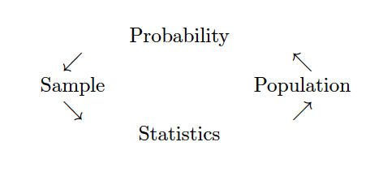
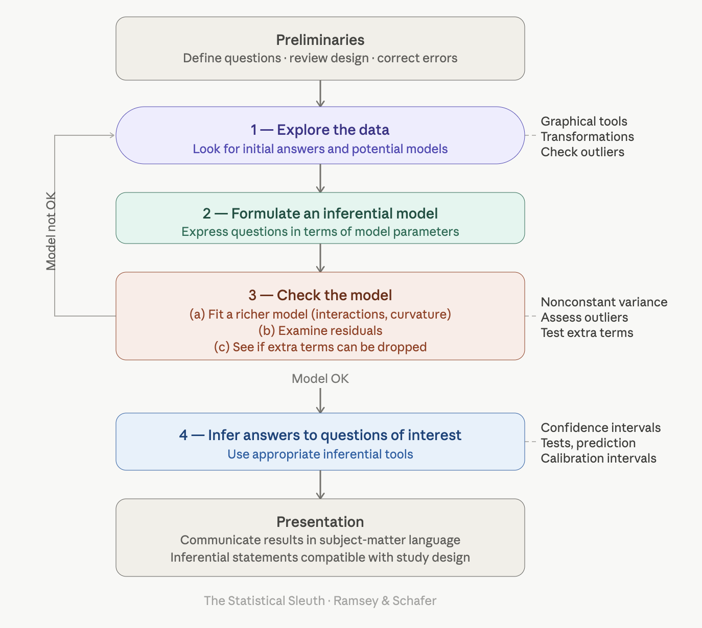

```{r}
#| include: false

# figure options
knitr::opts_chunk$set(
  fig.width = 10, fig.asp = 0.618, out.width = "90%",
  fig.retina = 3, dpi = 300, fig.align = "center"
)
```

```{r}
#| echo: false

# load packages
library(tidyverse)
library(tidymodels)
library(gghighlight)
library(knitr)
options(pillar.width = 70)

# set default theme and larger font size for ggplot2
ggplot2::theme_set(ggplot2::theme_minimal(base_size = 20))
```

## Inference

```{r fig.cap = "Probability vs. Statistics",  out.width="95%", fig.align='center', echo=FALSE}

```

## Random

::: {style="font-size: 0.8em"}
| | Random *sampling* | Random *assignment* |
|--|-------|-------|
| **Issue** | How to obtain observational units to be studied | How observational units come to be in groups to be compared |
| **Goal** | Select a sample that is representative of the population in all respects | Produce groups that are as similar as possible in all respects, except for the treatment being assigned |
| **Conclusion** | Generalize results from sample to population | Draw cause-and-effect conclusion, if difference in response between groups is statistically significant |
:::


## Randomization

Break the relationship between the explanatory and response variable to generate a *null sampling distribution*.

$\rightarrow$ the null sampling distribution sets up the p-value calculation.

## Bootstrapping

Generate new samples from the original data to generate a *sampling distribution* (where the null is not necessarily true!)

$\rightarrow$ the sampling distribution leads to a confidence interval for the parameter of interest.

## Mathematical modeling

Can generate an approximate *null sampling distribution* and plain *sampling distribution* using mathematical tools.

$\rightarrow$ leads to both p-values for hypothesis testing and also to confidence intervals.

## p-value

> p-value is the probability of the observed data or more extreme given the null hypothesis is true.

## Errors

* What errors can be made in inferential conclusions?
* How is Type I error ($\alpha$) control important?
* How is power important?
* How is sample size important?

## Model Building

<div>
  <center></center>
</div>


## AI

Statisticians are vital to the beginning and the end of the process.

* What questions to ask?
* How were the data generated?
* Can causation be claimed?
* Can you generalize to the population?
* What is the context within which the analysis is taking place?


