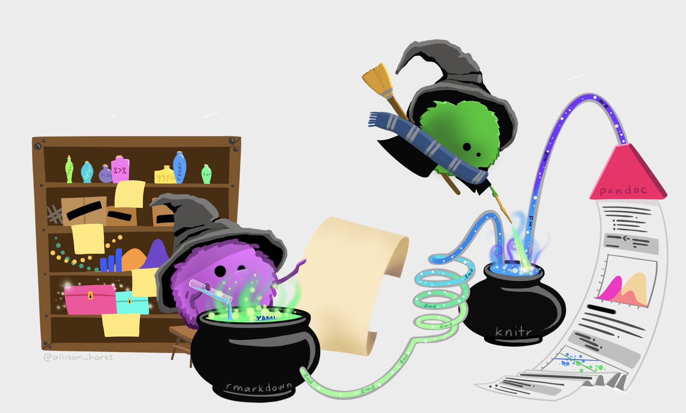

```{r setup, include=FALSE}
knitr::opts_chunk$set(echo = FALSE)
```

```{r fig.cap = "Artwork by @allison_horst.", fig.alt = "Two monsters working magic to come up with a complete data analysis and presentation.", preview = TRUE, echo = FALSE}

```

# Project Instructions

You will undertake a computational statistics project on a topic of your choice focused on a **dataset**. The project is an opportunity to show off what you've learned about the entire process of running a computational statistics analysis. It is a major component of the class, and successful completion is required to pass. Your final output for this project will be:

1. a technical report written in R Markdown, compiled to pdf  
2. an oral presentation delivered to the class

## Group Formation

You will work in a group of (approximately) three students. You may choose your own groups, or I would be happy to assign you to a group. The best groups will have team members with similar interests as far as application areas (e.g., biology, economics, etc.) but differing abilities and interests in terms of computational statistics (e.g., a stronger programmer combined with a visualization designer combined with a domain knowledge expert). See <a href = "https://m154-comp-stats.netlify.app/roles.html" target="_blank">Group Roles</a> for more information on allocating tasks.

## Assignment

Your task is to use data to tell us something interesting. This project is deliberately open-ended to allow you to fully explore your creativity. There are three main rules that must be followed:

1. Your project must be centered around data. Preferably, you will work with large, complex, and/or messy data. The more challenging your data set is, the better. Two things that will make your project more ambitious (and more interesting) are:  
   * Combining two or more data sets that are not obviously related. For example, in the tweets predicting elections paper from the first day of class, the researchers had to combine data from Twitter that had nothing to do with politics with a data set of congressional districts, and both data sets had to be spatially-aware, since the merging was done according to the geographical location of the tweet.  
   * Accessing a live data stream. There are many APIs on the Internet that allow you to access data that changes on a continual basis. This is in contrast to static data that was collected at some point in time and does not change. If your project can respond dynamically to a live data stream, then this will make it more interesting.  
Please note that neither of the above stipulations are requirements – they are merely examples of two considerations that may make your data more challenging to work with – and thus your project more ambitious.

2. Your project must tell us something. We've seen a range of projects / analyses over the course of the semester. On one extreme are visualization projects (like Snow's cholera map) that involve virtually no statistical analysis. On the other extreme are data mining projects like the KDD cup or Kaggle competitions, which involve very little visualization. Your project can be anywhere on this spectrum, but expectations may be different depending on where you are on the scale. An example of a project that doesn't tell us anything, would be something that downloads a single data source and summarizes it, with some perfunctory visualization. Make sure that your project is thought-provoking and has some underlying meaning!

3. To get an A, you must show something beyond what we've done in class. Some examples:
Use a new data mining technique (e.g., an artificial neural network, näive Bayes classifier)
Use a new programming technology (e.g., Python, MapReduce, shell scripting...  should be new to you!)  
   * Use a new visualization technology (e.g., Inkscape, Illustrator, Shiny, Processing)  
   * Use a new live data source or API (e.g., Flickr, Facebook, <a href = "https://github.com/amrrs/coinmarketcapr" target = "_blank">CoinMarketCap</a>) [Note: just downloading a new data set in a flat file does not count!]  
   * Use a new data format (e.g., XML, HDF5, JSON)  
   * Compare two datasets (e.g., <a href = "https://github.com/rundel/Dennys_LaQuinta_Chance" target = "_blank">La Quinta vs. Dennys</a>!)   
Also, domain knowledge does not count here, so your outside knowledge of protein folding makes for a great motivation, but it doesn't count as something extra.

4. At some point in the project, you should give an analysis/discussion of where the data came from and what/who it represents.

5. Last, you must address any ethical considerations that came about during the project.  How were you or weren't you able to address the ethical issues that came up?    
In addition to the examples you have seen over the course of the semester (and previous project links given at the bottom of this page), here are some generic ideas:  

   * Compete (strongly) in a past KDD cup or Kaggle competition    
   * Create a GoogleMaps mash-up  
   * Write an `R` package that provides an API to an online data set  
   * Create a Shiny application that helps a Pomona professor analyze their data  


### General Rules

You may discuss your project with other students, but each group will have a different topic, so there is a limit to how much you can help each other. You may consult other sources, and you should **credit all sources** in your report. Feel free to consult with me or your mentors.


# Components

## Proposals

Your initial proposal (via email to me) is due by midnight on Tuesday, October 26th. The final proposal (via GitHub project site) will be due the following week on November 2nd.

Prior to writing your initial proposal you should get together with your group-mates and brainstorm a half dozen or so ideas before coalescing around one idea. Be ambitious! Once you decide on a topic that interests you, think about what you would like to end up with as a final result – without worrying about how to get there. Try to visualize what your end product will look like. Will it be an interactive map? A predictive model? A mobile application? Don't think about coding, or a particular data set, or what you know how to do now. If you come up with something ambitious and original, you'll be more motivated to learn new things as you go in order to accomplish your goal.

The topic is completely open to your choice, but keep in mind the three main rules listed above. Try to think about how you will satisfy the criteria.

### Content

Your initial (via email) and revised (via GitHub) proposals should contain the following content:

1. Group Members: List the members of your group. For the revised proposal, add additional information about each person's role. Each member of the group should have two jobs: (1) a group dynamic role, (2) a project role. See <a href = "https://m154-comp-stats.netlify.app/roles.html" target="_blank">Group Roles</a> for more information on allocating tasks.

2. Title: The title of your project

3. Purpose: Describe the general topic/phenomenon you want to explore, as well some carefully considered questions that you hope to address. You should make an argument motivating your work. Why should someone be interested in what you are doing? What do you hope people will learn from your project?

4. Data: As best you can, describe where you will find your data, and what kind of data it is. Will you be working with spatial data in shapefiles? Do the data come from json files?  Will you be accessing an API to a live data source? Be as specific as you can, listing URLs and file formats if possible.

5. Variables: As much as possible, list, and briefly describe, each variable that you plan to incorporate. If you can, be specific about units, scale, etc.

6. End Product: Describe what you hope to deliver as a final product. Will it be a Shiny application that will be posted on the Internet? Will it be a GoogleMaps mash-up? Will it be a package that provides an API to a live data source (e.g., twitteR)? Will it be a method that draws some statistical conclusions? Will it be a predictive model that forecasts future values of some quantity?


## Update

Please respond to the following three questions (posted to your GitHub repo) by the end of the day Friday, November 19th.

1. Have you already collected, or do you have access to, all of the data that you will need in order to complete your project? If not, please estimate the percentage of the data that you have, describe any issues that you are having, and what your plan is for getting the rest of the data.

2. What is the single biggest unresolved issue you are having? Please describe it briefly, and what your plan is for resolving this issue.

3. What are the elements from outside of the course, if any, that you plan to incorporate into your project?


## Presentation

An effective oral presentation is an integral part of this project. One of the objectives of this class is to give you experience conveying the results of a technical investigation to a non-technical audience in a way that they can understand. Whether you choose to stay in academia or pursue a career in industry, the ability to communicate clearly is of paramount importance. As a statistician (data scientist, software engineer, etc.), the burden of proof is on you to convince your audience that what you are saying is true. If your audience (who may very well be less knowledgeable about statistics than you are) cannot understand your results or their interpretations, then the technical merit of your project is irrelevant.

On Friday/Tuesday, December 10/14th, your group will make a 10-12 minute oral presentation to the class. You should make (good) slides. Your goal should be to convey to your audience a clear understanding of your research topic, along with a basic understanding of your project, and how well it addresses the research question you posed. You should **not** tell us everything that you did, or show a bunch of things that you tried that didn't work well. After hearing your talk, each student in the class should be able to answer:

1. What was your project about?  
2. What format was the original data in, and what [downloading, data wrangling, data analysis] techniques did you apply to it?  
3. What were your findings?

You should prepare electronic slides for your talk. PowerPoint is fine, but you might also want to consider Markdown slides (<a href = "http://rmarkdown.rstudio.com/ioslides_presentation_format.html" target = "_blank">ioslides</a>, <a href = "http://rmarkdown.rstudio.com/slidy_presentation_format.html" target = "_blank">Slidy</a>, or <a href = "http://rmarkdown.rstudio.com/revealjs_presentation_format.html" target = "_blank">reveal.js</a>), Google Presentation, Beamer (LaTeX), or alternative, non-linear presentation software like <a href = "http://prezi.com/" target = "_blank">Prezi</a>. Use your creativity! One thing you should not do is walk us through your calculations in R Studio. If your project has any interactive elements, please demonstrate them for us!

You will need to email me and submit your slides to GitHub before your presentation, and as a back-up ideally the presentation will also live in the cloud somewhere. You should plan to **not** hook up your laptop to the computer in Millikan 1021 (unless you have good reason and have spoken to me about it beforehand).

### Advice

There are many sources of advice for how to make a good presentation, but an excellent place to start is a project called <a href = "http://techspeaking.denison.edu/" target = "_blank">Technically Speaking</a>.

Watch the videos on this site to identify some common mistakes. Here is some general advice:

   * Budget your time. You only have ~10 minutes, and we will be running a tight schedule. Plan for 8-10 minutes to talk, and 2 minutes to answer questions. If your talk runs too short or too long, it makes you seem unprepared. Rehearse your talk ahead of time (with your group) several times in order to get a better feel for your timing. Note also that you may have a tendency to talk faster during your actual talk than you will during your rehearsal. Talking faster in order to speed up is not a good strategy – you are much better off simply cutting material ahead of time.  
   * Don't write too much on each slide. You don't want people to have to read your slides, because if the audience is reading your slides, then they aren't listening to you. You want your slides to provide visual cues to the points that you are making – not substitute for your spoken words. Concentrate on graphical displays and bullet-pointed lists of ideas (not sentences).  
   * Put your problem in context. Remember that most of your audience will have little or no knowledge of your subject matter. The easiest way to lose people is to dive right into technical details that require prior domain knowledge. Spend a few minutes at the beginning of your talk introducing your audience to the most basic aspects of your topic and present some motivation for what you are studying.  
   * Speak loudly and clearly. Remember that you know more about your topic that anyone else in the room, so speak and act with confidence!  
   * Tell a story – not necessarily the whole story. It is unrealistic to expect that you can tell your audience everything that you know about your topic in 10 minutes. You should strive to convey the big ideas in a clear fashion, but not dwell on the details. Your talk will be successful if your audience is able to walk away with an understanding of what your research question was, how you addressed it, and what the implications of your findings are.

## Write-Up

Your write-up will similar to a report to client crafted in R Markdown, compiled to a pdf, due on Tuesday, December 14th by midnight. 

In your write-up, you should tell a data science audience about your project, why they should care about it, and what you have discovered. Your audience will be people like you – current or aspiring data scientists. Keep in mind that this audience is extraordinarily diverse in terms of skills and abilities, so you should assume very little about what they might know. However, your audience is reasonably tech-savvy, so you need not "dumb-down" your analysis.

```{r eval = FALSE, include = FALSE}
Consider some examples of blog posts that might be similar to what you write (http://simplystatistics.org, http://www.statsblogs.com, http://r-bloggers.com, http://fivethirtyeight.com, or http://www.statschat.org.nz for examples.). Your write-up / client report / blog entry will need to be a bit more thorough than many of the blog examples, since you will have to actually explain what you have done to your audience. Your write-up should make it clear to me and any other student in the class what methods and techniques you have used to produce your finished product.
```

Note that ideally, you would be able to use the write-up to show a future employer or graduate school an example of something interesting which you have produced.

### Content

You do not need to present all of the R code that you wrote throughout the process of working on this project. However, the write-up should contain the minimal set of R code that is necessary to understand your results and findings. If you make a claim, it must be justified by explicit calculation. A knowledgeable reviewer should be able to compile your .Rmd file without modification (caveat: unless you also did work outside of R), and verify every statement that you have made. All of the R code necessary to produce your figures and tables must appear in the .Rmd version of the write-up.  All of the R code necessary to understand your work should appear in the .pdf version of the write-up.

Any data you use should either be obtained dynamically (e.g., from a website) or saved into your project repository (unless the dataset is too big, and we've already discussed that the data are hosted locally).

### Motivation

Be sure to motivate your topic at the beginning of your write-up. You should try to hook the reader early on. Assume that your audience is a skeptical data scientist who has stumbled across your write-up but has very little time to read it. Can you give her a reason to continue reading? A cool visualization or result can help.

### Format

You don't need to follow a specific format in the write-up, but you should start with an introductory paragraph and finish with a conclusion. The paragraphs needs not follow the formal writing style that you would use in most other classes. Here, a colloquial style that is accessible to a lay reader is appropriate.

Nevertheless, your write-up should address the following questions:

1. Why should anyone care about this?  
2. What is the project about? Do not assume that your readers have any domain knowledge! The burden of explanation as to what you are talking about is on you! For example, if your project involves phylogenetic trees, do not assume that your audience has anything other than a basic, lay understanding of genetics.  
3. Where did your data come from? What kind of data was it? Is there a link to the data or some other way for the reader to follow up on your work?  Be sure to cite / reference where your data came from!!  
4. What are your findings? What kind of statistical computations (if any) have you done to support those conclusions? Again, while the R code will show how the calculation was performed, it is up to you to interpret, in English sentences, the results of these calculations. Do not forget about units, axis labels, etc.  
5. What are the limitations of your work? Be clear so that others do not misinterpret your findings. To what population do your results apply? Do they generalize? Could your work be extended with more data or computational power or time to analyze? How could your study be improved? Suggesting plausible extensions don't weaken your work – they strengthen it by connecting it to future work.  
6. What ethical considerations that came about during the project.  How were  you or weren't you able to address those issues?  
7. What did you learn beyond what we've covered in class?

### Style

The notebook (i.e., Rmd + pdf) format is designed to be an interactive document. Take advantage of this by including hyperlinks, figures, videos, etc. to provide context for the reader. It is likely that you will include references section or a <a href = "http://rmarkdown.rstudio.com/authoring_bibliographies_and_citations.html" target = "_blank">bibliography</a>, and your references should be embedded via links. Use Markdown elements like links, lists, LaTeX, and images as needed.

Visualizations, particularly interactive ones, will be well-received. That said, do not overuse visualizations. You may be better off with one complicated but well-crafted visualization as opposed to many quick-and-dirty plots. *Do not forget Tufte*! Any plots should be well-thought out, properly labelled, informative, and visually appealing!

The R code is there to support the technical reader who wishes to dig into your work – not to substitute for written explanation. Do not present long unbroken chunks of R code without offering written explanations. It is rarely necessary to have more than three or four lines of R code in a single chunk. Feel free to `echo=FALSE` any code which is not relevant to the story you are telling. 

### Citing Sources

As you know, you should cite all references that you use.  This includes (among other things) research articles, important information (e.g., "7% of NHL players are non-white"), R packages, other (e.g., Python) packages, and relevant algorithms (e.g., NRC Word-Emotion Association Lexicon).  You may use any formatting for the citations as long as the citations are consistent, standard usage, and contain all relevant information for your reader to find the appropriate documentation.

The information you need to cite any R package is given by the R command citation().  For example:

> `> citation("dplyr")`

> To cite package ‘dplyr' in publications use:

> Hadley Wickham, Romain Francois, Lionel Henry and Kirill Müller (2017). dplyr: A Grammar of Data Manipulation. R package version 0.7.4. https://CRAN.R-project.org/package=dplyr

> A BibTeX entry for LaTeX users is

> @Manual{,
title = {dplyr: A Grammar of Data Manipulation},
author = {Hadley Wickham and Romain Francois and Lionel Henry and Kirill Müller},
year = {2017},
note = {R package version 0.7.4},
url = {https://CRAN.R-project.org/package=dplyr},
}


### Group Dynamic Report

Ideally, all group members would be equally involved and able and committed to the project. In reality, it doesn't always work that way. Individuals should be rewarded fairly for their group efforts; it's inevitable that there will be variation in how high a priority people put on this class and how much effort they put into this project.

To this end, I would like each of you (individually) to describe how well (or how poorly!) your project group worked together and shared the load. This can take the form of an email (not GitHub because of the personal nature), to be submitted by the Tuesday December 14th. Also give some specific comments describing each member's overall effort. Were there certain group members who really put out exceptional effort and deserve special recognition? Conversely, were there group members who really weren't carrying their own weight? And then, at the end of your assessment, estimate the percentage of the total amount of work/effort done by each member. (Be sure your percentages sum to 100%!)

For example, suppose you have 3 group members: X, Y and Z. In the event that each member contributed equally, you could assign:

* 33.3% for member X, 33.3% for member Y, and 33.3% for member Z

Or in case person Z did twice as much work as each other member, you could assign:

* 25% for member X, 25% for member Y, and 50% for member Z

Or if member Y didn't really do squat, you could assign:

* 45% for member X, 10% for member Y, and 45% for member Z

I will find a fair way to synthesize the (possibly conflicting) assessments within each group and fairly incorporate this assessment of effort and cooperation in each individual's overall grade. Don't pressure one another to give everyone glowing reports unless it's warranted, and don't feel pressured to share your reports with one another. Just be fair to yourselves and to one another. Let me know if you have any questions or if you run into any problems. Also keep in mind that GitHub tracks who is committing and who is not committing.

# Assessment Criteria

Your project will be evaluated based on the following criteria:

* Originality/Interest: Is the topic original, interesting, and substantial – or is it trite, pedantic, and trivial? How much creativity, initiative, and ambition did the group demonstrate? Is the basic question driving the project worth investigating, or is it obviously answerable without a data-based study?
* Degree of Difficulty: How challenging was the project? Were the data particularly large, complex, and/or messy? Did the data come in an obscure format? Was a scraper or API necessary to acquire the data? Was a challenging visualization or applet constructed? Were any elements from outside the coursework necessary to complete the project?
* Design: How well were the graphical elements of the project designed? Were they clunky or elegant? Was a truly original view of the data presented? Were any interactive elements usable?
* Meaning/Analysis: Did we learn anything meaningful from this project? Are the chosen analyses appropriate for the variables/relationships under investigation, and are the assumptions underlying these analyses met? Are the analyses carried out correctly? Did the group make appropriate conclusions from the analyses, and are these conclusions justified?
* Write-Up: How effectively does the write-up communicate the goals, procedures, and results of the study? Are the claims adequately supported? Does the writing style enhance what the group is trying to communicate? How well is it edited? Are the statistical claims justified? Are text and analyses effectively interwoven? Clear writing, correct spelling, and good grammar are important.
* Oral Presentation: How effectively does the oral presentation communicate the goals, procedures, and results of the study? Do the slides help to illustrate the points being made by the speaker without distracting the audience? Do the presenters seem to be well-rehearsed? Did they properly budget their time? Do they appear to be confident in what they are saying? Are her arguments persuasive?

## Presentation Evaluation

The questions below will be used to evaluate the oral presentations.

### Peer rubric

Each of you will evaluate the presentations of your peers keeping the following grading rubrics in mind.

   * Mastery of the material (understanding of the material is strong and well communicated)
   * Background, completeness (thoroughly explains all key points)
   * Presentation evaluation (organized, communicates effectively with the audience)


# Some Project Examples / Ideas:

* <a href = "https://ziqixiong.shinyapps.io/TopicModeling" target = "_blank">Topic Modeling</a> by Benji Lu, Kai Fukutaki, and Ziqi Xiong
* <a href = "https://github.com/rundel/Dennys_LaQuinta_Chance" target = "_blank">La Quinta vs. Dennys</a> (Colin Rundel & Mine Çetinkaya-Rundel.  <a href = "https://www.rstudio.com/resources/webinars/data-science-case-study/" target = "_blank">Webinar about the study</a>.  (What if you look at Holiday Inns???)
* <a href = "https://tcai.shinyapps.io/airbnbtextanalysis/" target = "_blank">Airbnb Text Analysis</a> by Tianyuan Cai, Jiwon Lee, and Ethan Matlin
* <a href = "https://github.com/robinspollak/R.openFEC" target = "_blank">R package for downloading FEC data</a> by Robin Pollak and Jeff Carney 
* <a href = "https://math154-fall2017-vegas.shinyapps.io/lvmapbackup/" target = "_blank">Vegas Baby</a> by Gwen Song, Amy Oden, and Judy Cheng
* <a href = "https://fordc5.github.io/ExtremeWeatherAndTerrorism/" target = "_blank">Weather and Terrorism</a> by Connor Ford and Bradley Druzinsky
* <a href = "https://mweinstock02014.shinyapps.io/twitter_app/" target = "_blank">NGO information via Twitter</a> by Molly Weinstock, Alex Pusch, and Melissa Hooke
Investigative data project on copy-cat bills making it through congress.  <a href = "https://www.azcentral.com/pages/interactives/asbestos-sharia-law-model-bills-lobbyists-special-interests-influence-state-laws/" target = "_blank">Here</a> is a visual summary, <a href = "https://publicintegrity.org/state-politics/copy-paste-legislate/how-we-uncovered-10000-times-lawmakers-introduced-copycat-model-bills-and-why-it-matters/" target = "_blank">here</a> is a bit on the methodology, and <a href = "https://www.usatoday.com/in-depth/news/investigations/2019/04/03/abortion-gun-laws-stand-your-ground-model-bills-conservatives-liberal-corporate-influence-lobbyists/3162173002/" target = "_blank">here</a> is a complete report. 
* <a href = "https://www.storybench.org/mapping-search-data-from-google-trends-in-r/" target = "_blank">Google trends</a> by Peer Christensen


Assignment originally inspired by Ben Baumer at Smith College.


