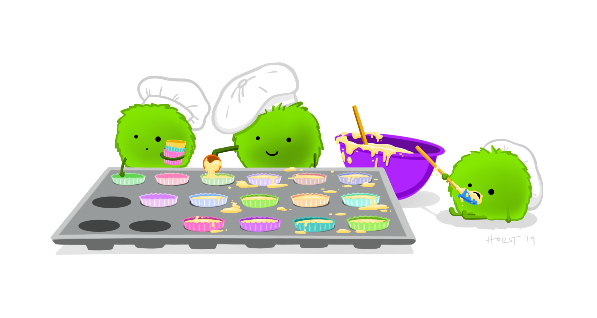

```{r setup, include=FALSE}
knitr::opts_chunk$set(echo = FALSE)
```

```{r fig.cap = "Artwork by @allison_horst.", fig.alt = "Three monster bakers working together to make cupcakes.", preview = TRUE, echo = FALSE}

```

### Norms for the Project

1. No one individual is as smart as the entire group.
2. Everyone has something to offer.
3. Everyone has a responsibility to help others in their group.
4. Everyone has a responsibility to understand the full project and to ask for help if they need it.

## Roles for the Projects

Each individual will have (at least) 2 roles; one role to help foster the group dynamics and the other role to divvy up the responsibilities involved in completing the project.

### Group Dynamic Roles:

* **Project Manager:**  Makes sure that the group is organized and has a clear plan for completing the project.  This includes scheduling meetings and having a plan for what needs to be done before the next meeting.  
* **Task Manager:**  Makes sure that everyone knows what they are expected to do before the next meeting and makes sure that they do it.  This might involve calling or emailing each person between meetings to discuss what they have/haven't done.  If someone can't do the work that needs to be done, the task manager is responsible for calling another meeting if needed.  
* **Facilitator:**  Makes sure that every member of the group is participating and being listened to and heard.  This might involve asking questions of a member that's been silent and stopping others when someone's comment is being overlooked.

### Project Roles

In each case, the person assuming that role is responsible for that aspect of the project.  It doesn't mean that they will do all that part of the project by themselves; it means that they are responsible for dividing that work up among the members of the group and ensuring that it is done and recorded correctly.

* **Director of Research:**  Is responsible for the literature searches.  The Director of Research identifies what needs to be searched for in the literature, divvies up the literature searches to be performed among the group members, and coordinates changes in the searches based on information gathered and changes in direction.  They are also responsible for making sure that the citations in the project are complete and accurate.  
* **Director of Computation:**  Is responsible for the computer programs involved in the project.  The Director of Computation is responsible for designing the code so that different people can write different parts of the code.  The programmer is responsible for making sure that any code written by different people can be integrated.  
* **Reporter:** Is responsible for the written report.  This involves taking notes during the complete process in order to keep a record of what has been done.  The reporter may also gather everyone's individual notes and put them together.  The reporter is also responsible for editing the final report and making sure that the various pieces (that may have been written by different people) fit well together.
 


### Things to think about:

1. If all members of a group think that one member isn't pulling their weight then you can come and talk to me about it.  I can fire that member and have them do the project on their own.  
2. (Generally) All members of the group get the same grade for the project.  
3. Grade on projects (a rubric for grading will be posted soon, but generally the grade will be based on the following):  
   * Grade for technical depth and sophistication.    
   * Grade for quality of write-up (organization, clarity, grammatical correctness, appropriate use of graphs, tables, formulas).  
   * Grade for quality of oral presentation (organization, clarity, appropriate use of graphs, tables formula, ability to answer questions).   
   * Grade for quality of group work and distribution of labor.  
4. Attendance:  you should keep track of who is or isn't showing up to group project meetings  
5. Students should keep a record of all the times that they worked on the project and the work that they did.  Every time that you spend more than 15 minutes on the project they should write down the start and stop time and what they did.  Group members should be spending roughly the same amount of time on the project (I will ask you to report on time spent on the project so far at the check-in in November.)  
6. GitHub will track who is committing what to the repository.  Ideally, you will all be committing code regularly.


